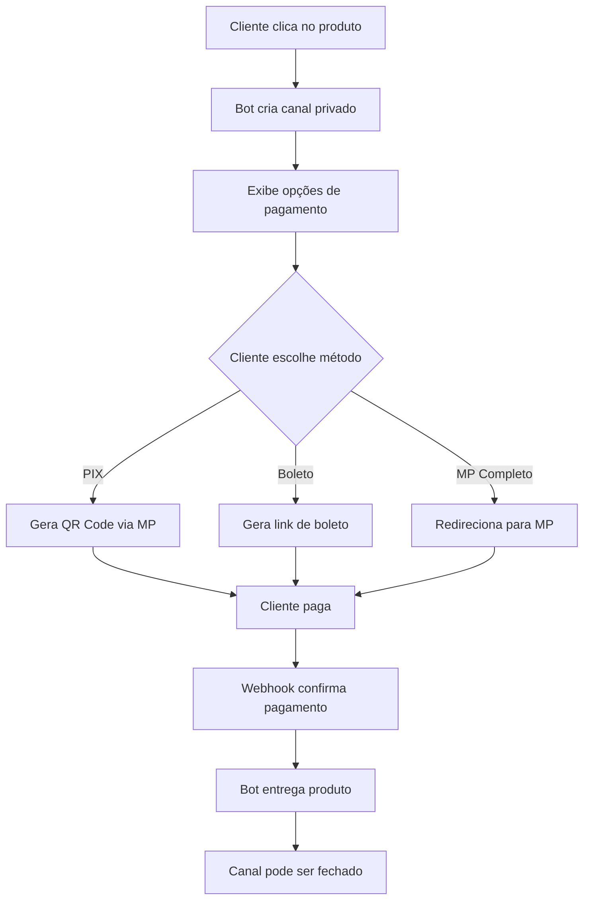

# 🛒 Guia do Catálogo Permanente com PIX/Boleto

## 📌 O que mudou?

Agora o bot funciona como os **bots de venda profissionais do Discord**:

### ✨ Novo Fluxo de Compra

1. **Catálogo Fixo** - Um canal com mensagem permanente mostrando todos os produtos
2. **Canal Privado Automático** - Quando o cliente clica em um produto, um canal privado é criado
3. **Pagamentos Integrados** - PIX com QR Code e Boleto direto no Discord
4. **Aprovação Automática** - Produto entregue automaticamente após pagamento confirmado

---

## 🚀 Como Configurar

### 1. Instalar Novas Dependências

```bash
npm install
```

Isso instalará o pacote `qrcode` necessário para gerar QR Codes de PIX.

### 2. Registrar Novo Comando

```bash
npm run deploy-commands
```

### 3. Criar Catálogo Permanente

No Discord, use:

```
/setup-catalog canal:#vendas
```

**O que acontece:**
- Uma mensagem com todos os produtos é enviada no canal escolhido
- A mensagem é fixada automaticamente
- Botões são criados para cada produto/categoria
- Clientes podem clicar e comprar diretamente

---

## 💳 Métodos de Pagamento Disponíveis

### 1. **PIX** (Recomendado) 💚
- QR Code gerado automaticamente no Discord
- Código "Copia e Cola" incluso
- Aprovação **instantânea**
- Cliente recebe o produto em segundos

### 2. **Boleto Bancário** 🎫
- Link direto para gerar boleto
- Compensa em até 2 dias úteis
- Produto entregue após compensação

### 3. **Mercado Pago Completo** 💳
- Redireciona para página do Mercado Pago
- Aceita PIX, Boleto, Cartão
- Todas as opções de pagamento

---

## 📝 Exemplo de Uso

### Passo a Passo do Cliente

1. Cliente vê o catálogo fixo no canal #vendas
2. Clica no botão do produto desejado (ex: "Minecraft Premium - R$ 25,00")
3. Um canal privado é criado automaticamente: `🛒・minecraft-premium-abc123`
4. No canal privado, o cliente vê:
   - Informações do produto
   - Opções de pagamento
5. Cliente clica em "💚 Pagar com PIX"
6. Bot gera:
   - QR Code (imagem)
   - Código Copia e Cola
   - Instruções de pagamento
7. Cliente paga via app do banco
8. **Produto é entregue automaticamente** no canal
9. Canal pode ser fechado após X minutos (configurável)

---

## ⚙️ Configurações Adicionais

### Criar Categoria de Vendas (Opcional)

Para organizar melhor os canais de compra:

```
/config setup
```

Escolha ou crie uma categoria "🛒 VENDAS" onde todos os canais temporários serão criados.

### Configurar Chave PIX (Mercado Pago)

As chaves PIX são gerenciadas automaticamente pelo Mercado Pago. Certifique-se de que sua conta do Mercado Pago está configurada:

```
/config payment-set provider:mercadopago api_key:TEST-...
```

---

## 🎯 Vantagens do Novo Sistema

| Recurso | Antes | Agora |
|---------|-------|-------|
| **Catálogo** | Comando temporário | Mensagem fixa permanente |
| **PIX** | Link externo | QR Code no Discord |
| **Boleto** | Link externo | Gerado no Discord |
| **Canal de Venda** | Não tinha | Canal privado automático |
| **Experiência** | 5 cliques + redirecionamentos | 2 cliques direto no Discord |

---

## 🔧 Comandos do Administrador

### Configurar Catálogo
```
/setup-catalog canal:#vendas
```

### Adicionar Produto
```
/addproduct
```

### Editar Produto
```
/editproduct
```

### Ver Estatísticas
```
/stats
```

### Configurar Pagamentos
```
/config payment-set provider:mercadopago api_key:SEU_TOKEN
/config payment mercadopago:true
```

---

## 📊 Fluxo Técnico



---

## 🐛 Solução de Problemas

### QR Code não aparece
- Verifique se `qrcode` está instalado: `npm install`
- Verifique se o token do Mercado Pago é válido (TEST ou PROD)

### Canal privado não é criado
- Bot precisa ter permissão de "Gerenciar Canais"
- Verifique se há uma categoria configurada: `/config setup`

### Pagamento não é confirmado
- Webhook do Mercado Pago deve estar configurado
- URL: `https://seu-dominio.com/webhooks/mercadopago`
- Use ngrok para testes locais

### Produto não é entregue
- Verifique logs do bot: `npm run dev`
- Confirme que o webhook está recebendo notificações
- Teste manualmente: `/config payment-test`

---

## 🎨 Personalização

### Alterar Tempo de Expiração do Canal

Edite `src/utils/channelManager.ts`:

```typescript
export async function deleteChannelAfterDelay(
  channel: TextChannel,
  delayMs: number = 300000 // 5 minutos (300000ms)
)
```

### Customizar Mensagem do Catálogo

Edite `src/commands/setupcatalog.ts` - linha 44:

```typescript
.setDescription(
  '**Bem-vindo à nossa loja!**\n\n' +
  'Sua mensagem personalizada aqui...'
)
```

### Adicionar Mais Métodos de Pagamento

Edite `src/events/interactionCreate.ts` - função `handleCatalogProductClick`:

Adicione novos botões ao `paymentRow`.

---

## 📱 Teste em Ambiente de Desenvolvimento

### 1. Configure ngrok
```bash
ngrok http 3000
```

### 2. Configure webhook do Mercado Pago
Use a URL do ngrok: `https://abc123.ngrok.io/webhooks/mercadopago`

### 3. Use credenciais de TEST
```
/config payment-set provider:mercadopago api_key:TEST-...
```

### 4. Teste com cartões de teste
Veja: https://www.mercadopago.com.br/developers/pt/docs/checkout-pro/additional-content/test-integration

---

## 🌟 Próximas Funcionalidades

- [ ] Categorias de produtos funcionais
- [ ] Sistema de carrinho (múltiplos produtos)
- [ ] Desconto por quantidade
- [ ] Programa de afiliados
- [ ] Analytics detalhado
- [ ] Notificações push

---

## 💡 Dicas de UX

1. **Nome dos Produtos**: Use nomes curtos e diretos (max 25 caracteres para botões)
2. **Imagens**: Sempre adicione imagens aos produtos (melhora conversão)
3. **Descrições**: Seja claro sobre o que o cliente vai receber
4. **Preços**: Use valores redondos quando possível (R$ 25,00 ao invés de R$ 24,99)
5. **Estoque**: Mantenha o estoque atualizado para criar senso de urgência

---

## 📞 Suporte

Problemas? Abra uma issue no GitHub ou consulte os logs do bot para debugging detalhado.

**Logs importantes:**
- `✅ Canal de compra criado` - Canal privado criado com sucesso
- `💚 PIX gerado` - QR Code gerado
- `✅ Pagamento confirmado` - Webhook recebeu confirmação
- `📦 Produto entregue` - Cliente recebeu o produto
